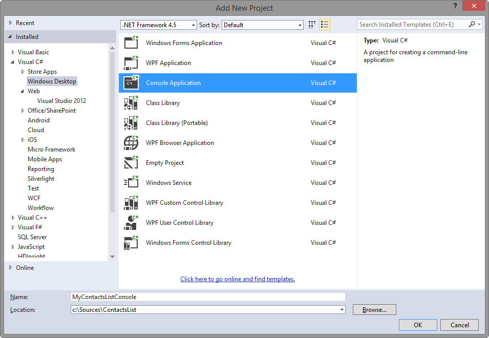
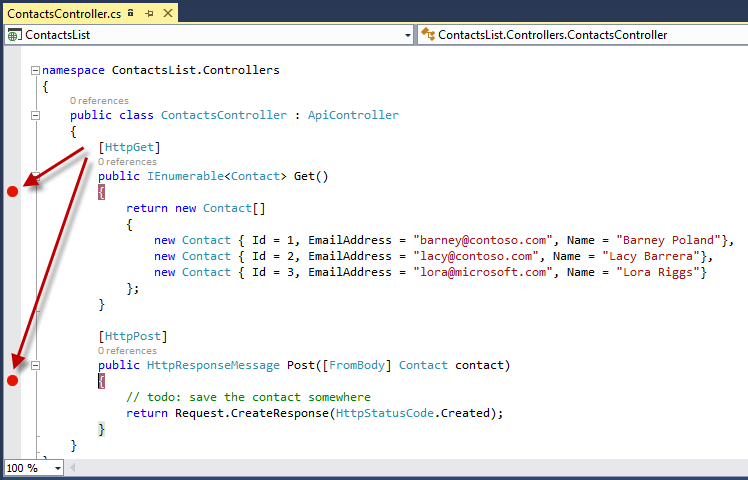

<properties 
	pageTitle="Debug an API App in Azure App Service" 
	description="Learn how to debug an API App while it runs in Azure App Service, using Visual Studio." 
	services="app-service\api" 
	documentationCenter=".net" 
	authors="bradygaster" 
	manager="wpickett" 
	editor="jimbe"/>

<tags 
	ms.service="app-service-api" 
	ms.workload="web" 
	ms.tgt_pltfrm="dotnet" 
	ms.devlang="na" 
	ms.topic="article" 
	ms.date="05/19/2015" 
	ms.author="bradyg;tarcher"/>

# Debug an API App in Azure App Service 

## Overview

In this tutorial, you'll debug ASP.NET Web API code while it runs in an [API app](app-service-api-apps-why-best-platform.md) in [Azure App Service](app-service-value-prop-what-is.md). The tutorial works with the API app that you [create](app-service-dotnet-create-api-app.md) and [deploy](app-service-dotnet-deploy-api-app.md) in the previous tutorials in this series.

You begin by using Visual Studio's **API App Client** feature to generate client code that calls the deployed API app. Then, you debug the client app and the API app simultaneously, with the API app running live in the cloud.

## Generate an API app client 

The API App tools in Visual Studio make it easy to generate C# code that calls to your Azure API Apps from desktop, store, and mobile apps. 

1. In Visual Studio, open the solution that contains the API app from the [Create API app](app-service-dotnet-create-api-app.md) topic. 

2. From **Solution Explorer**, right-click the solution and select the **Add** > **New Project**.

	

3. In the **Add New Project** dialog, perform the following steps:

	1. Select the **Windows Desktop** category.
	
	2. Select the **Console Application** project template.
	
	3. Name the project.
	
	4. Click **OK** to generate the new project in your existing solution.
	
	

4. Right-click the newly created console application project and select **Add** > **Azure API App Client**. 

	
	
5. In the **Add Microsoft Azure API App Client** dialog, perform the following steps: 

	1. Select the **Download** option. 
	
	2. From the drop-down list, select the API app that you created earlier. 
	
	3. Click **OK**. 

	

	The wizard will download the API metadata file and generate a typed interface for invoking the API App.

	

	Once code generation is complete, you'll see a new folder in Solution Explorer, with the name of the API app. This folder contains the code that implements the client and data models. 

	

6. Open the **Program.cs** file from the project root and replace the **Main** method with the following code: 

		static void Main(string[] args)
	    {
	        var client = new ContactsList();
	
	        // Send GET request.
	        var contacts = client.Contacts.Get();
	        foreach (var c in contacts)
	        {
	            Console.WriteLine("{0}: {1} {2}",
	                c.Id, c.Name, c.EmailAddress);
	        }
	
	        // Send POST request.
			client.Contacts.Post(new Models.Contact
		    {
		        EmailAddress = "lkahn@contoso.com",
		        Name = "Loretta Kahn",
		        Id = 4
		    });
	
	        Console.WriteLine("Finished");
	        Console.ReadLine();
	    }

## Test the API app client

Once the API app has been coded, it's time to test the code in the browser.

1. Open **Solution Explorer**.

2. Right-click the console application you created in the previous section.

3. From the console application's context menu, select **Debug > Start new instance**. 

4. A console windows should open and display all of the contacts. 

	

5. Press **Enter** to dismiss the console window.          

## Debug the API app 

Now that the API app and its client are coded and tested, let's see how to debug it.

1. From the Visual Studio **View** menu, select **Server Explorer**. 

2. In the **Server Explorer**, expand the **Azure > App Service** node. 

3. Locate the resource group that you created when you deployed your API app. 

4. Under the resource group, right-click the node for your API app and select **Attach Debugger**. 

	

	The remote debugger will try to connect. In some cases, you may need to retry clicking **Attach Debugger** to establish a connection, so if it fails, try again.

	

16. After the connection is established, open the **ContactsController.cs** file in the API App project, and add breakpoints at the `Get` and `Post` methods. They may not appear as active at first, but if the remote debugger is attached, you're ready to debug. 

	

17. To debug, right-click the console app in **Solution Explorer** and select **Debug** > **Start new instance**. Now, you can debug the API app remotely and the client app locally, and see the entire flow of the data. 

	The following screen shot shows the debugger when it hits the breakpoint for the `Post` method. You can see that the contact data from the client was deserialized into a strongly-typed `Contact` object. 

	

## Next steps

Remote debugging for API Apps makes it easier to see how your code is running in Azure App Service. Rich diagnostic and debugging data is available right in the Visual Studio IDE for Azure API apps. 

App Service API apps are App Service web apps that have additional features for hosting web services, so you can use the same debugging and troubleshooting tools for API apps that you use for web apps.  For more information, see [Troubleshoot a web app in Azure App Service using Visual Studio](web-sites-dotnet-troubleshoot-visual-studio.md). 

The API app you created in this series is publicly available for anyone to call. For information about how to protect the API app so that only authenticated users can call it, see [Protect an API app: Add Azure Active Directory or social provider authentication](app-service-api-dotnet-add-authentication.md).
