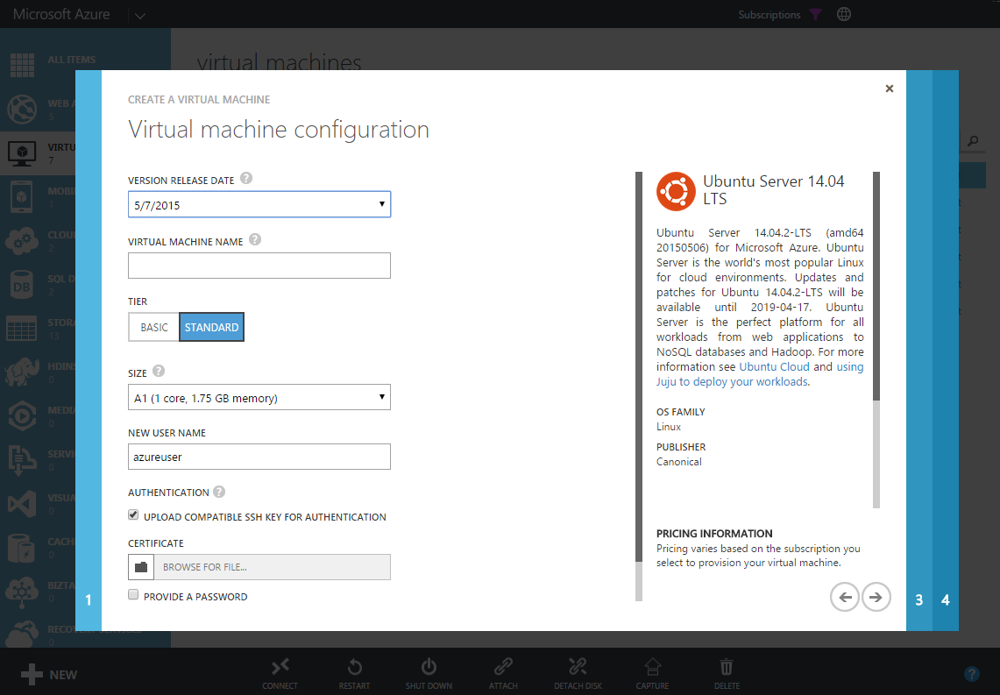

1. Sign in to the Azure [Management Portal](http://manage.windowsazure.com).
On the command bar, click **New**.

2. Click **Virtual Machine**, and then click **From Gallery**.

3. From **Choose an Image**, select an image from one of the lists. (The available images may differ depending on the subscription you're using.) Click the arrow to continue.

	

4. If multiple versions of the image are available, in **Version Release Date**, pick the version you want to use.

5. In **Virtual Machine Name**, type the name that you want to use. For this virtual machine, type **MyTestVM1**.

6. In **Size**, select the size that you want to use for the virtual machine. The size that you choose depends on the number of cores that are needed for your application.  For this virtual machine, choose the smallest available size.

7. In **New User Name**, type the name of the account that you will use to administer the virtual machine. You cannot use root for the user name. For this virtual machine, type **NewUser1**.

8. Under Authentication, check **Provide a Password**. Then, provide the required information and click the arrow to continue.

9. You can place virtual machines together in the cloud service, but for this tutorial, you're only creating a single virtual machine. To do this, select **Create a new cloud service**.

10. In **Cloud Service DNS Name**, type a name that uses between 3 and 24 lowercase letters and numbers. You'll need to come up with your own cloud service name because it must be unique in Azure. The cloud service name becomes part of the URI that is used to contact the virtual machine through the cloud service.

11. In **Region/Affinity Group/Virtual Network**, select where you want to locate the virtual machine.

12. You can select a storage account where the VHD file is stored. For this tutorial, accept the default setting of **Use an Automatically Generated Storage Account**.

13. Under **Availability Set**, for the purposes of this tutorial use the default setting of **None**. 

14.	Under **Endpoints**, review the endpoint that's automatically created to allow Secure Shell (SSH) connections to the virtual machine. (Endpoints allow resources on the Internet or other virtual networks to communicate with a virtual machine.) You can add more endpoints now, or create them later. For instructions on creating them later, see [How to Set Up Endpoints to a Virtual Machine](../articles/virtual-machines-set-up-endpoints.md).

15.  Under **VM Agent**, review the available extensions. These extensions provide various features that make it easier to use and manage a virtual machine. For details, see [Azure VM Extensions](http://go.microsoft.com/FWLink/p/?LinkID=390493). 

After Azure creates the virtual machine and cloud service, the Management Portal lists the new virtual machine under **Virtual Machines** and lists the cloud service under **Cloud Services**. Both the virtual machine and the cloud service are started automatically.